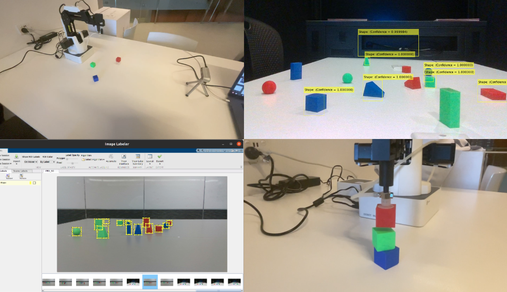
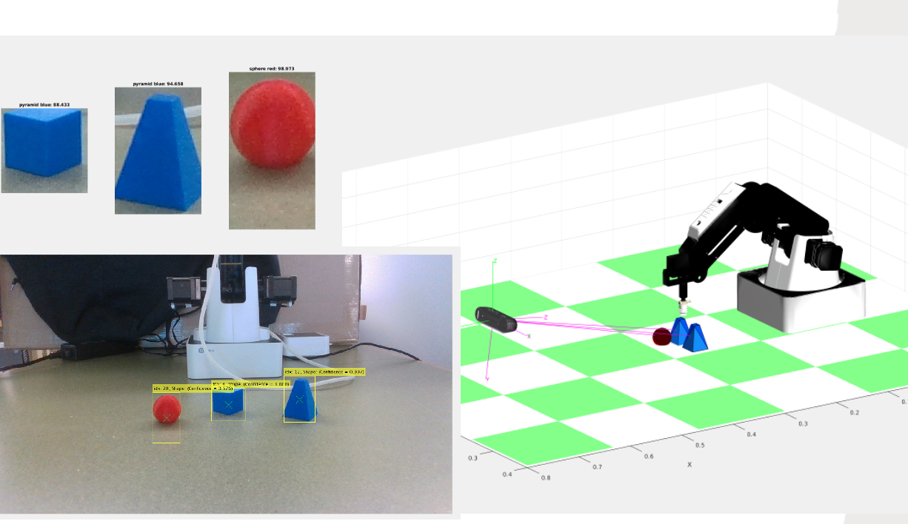

# dobotgrasping

Sensors & Control Lab Project AUT 2022

## Info

#### Brief:   

To detect, organise and stack shapes in the workspace using an Intel RealSense Camera and the Dobot Magician Robot Arm.

#### Execution:

The camera image is used as the input to the control logic implemented in MATLAB. 
A series of 52 scene images and 62 shape images have been used to train an two Deep Learning networks. An RCNNObjectDetector network was used to detect bounding box points around sections of the scene image. A GoogleNet network model was used to classify the bounding box section against the library of 12 shapes used for training. The ImageLabeler app was used to draw the bounding boxes over the training images for the scene detector. 

Further image processing to accurately detect the colour and centre of the shape are used to finalise the selection of satisfactory features in the image. The image points are then transformed from the camera frame to the robot frame and simulated in a figure window.

The world coordinates of the payloads in the robot frame are then picked and placed into two destination configurations, one where the payloads are stacked and one where the payloads are placed in colour order on the surface.

## Requirements

### MATLAB (> R2020a)

- Robotics Toolbox 
- Deep Learning Toolbox
- GoogleNet model
- Image Processing Toolbox

### System

- Dobot Magician ROS drivers by gapaul
- Intel Realsense ROS drivers by intel

## Getting Started

### Simulation using ros bag
1. Open `working/main_SNC.m`, follow comments

### Real Robot Control
1. Connect Dobot and Intel Camera to local system
2. Open `working/real_rob_control.m`, follow comments

**Camera Localization**

1. Open `working/localize_cam.m` and follow the comments
2. Requires camera, Dobot, and a object (eg: cube)

