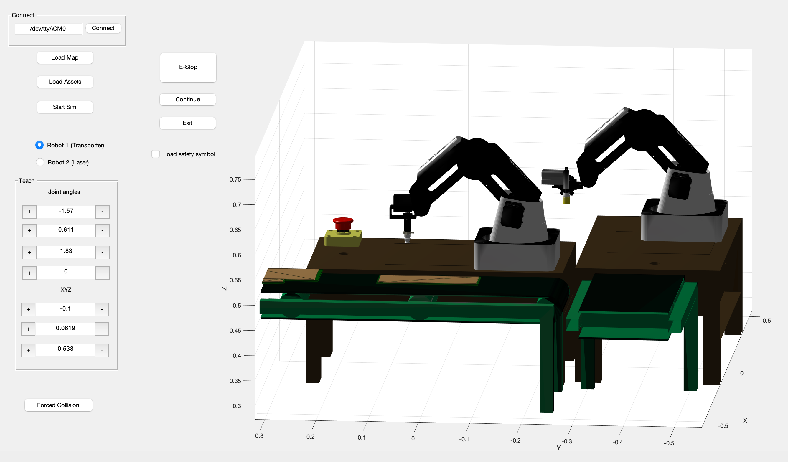

# dobotgrasping

Industrial Robotics Lab Assignment 2 AUT 2022

## Info

#### Brief:   

To simulate the operation of 2 Dobots to draw traces on a PCB.
We recorded a video of a real Dobot tracing a path on a page to emulate the

## Requirements

### MATLAB (> R2020a)

- Robotics Toolbox 

### System

- Dobot Magician ROS drivers by gapaul

## Getting Started

### Start up GUI

1. cd into `working` directory
2. Open `LAB2GUI.m`, follow load in assets

### Real Robot Control
1. Connect Dobot and Intel Camera to local system
2. Open `working/real_rob_ir.m`, follow comments
